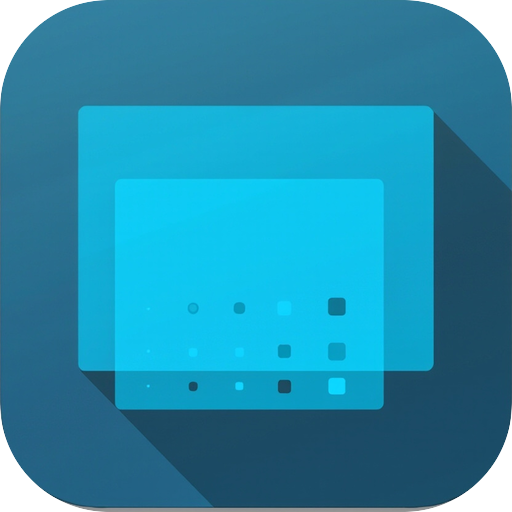
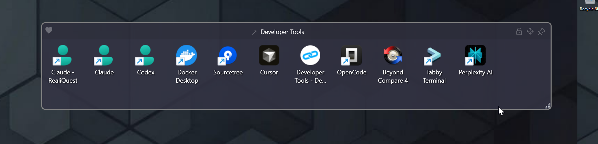

<h1 align="center">DesktopPossible</h1>
<p align="center"><i>Organize your desktop like magic!</i></p>
<p align="center"><b>A free, open-source Stardock Fences alternative for Windows 10/11</b> — group desktop icons into frames, mirror folders, and tidy your desktop.</p>

<p align="center">
  
</p>

<p align="center">
  
  <br /><sub>A Data frame on the desktop — title bar with the ♥ menu, position lock, move handle and keep-on-top pin. <a href="docs/images/screenshot-desktop.png">Full-desktop view</a>.</sub>
</p>

[](LICENSE)
[](https://github.com/DevPossible/DesktopPossible/releases)

---

> ### This is a hard fork
> DesktopPossible is a **hard fork** of [**Desktop Frames +**](https://github.com/limbo666/DesktopFramesPlus) (MIT) by **limbo666 / Nikos Georgousis**, which is itself a continuation of the original **BirdyFences** by **HakanKokcu**. All upstream work belongs to those authors — see [Credits](#credits).
>
> As a hard fork, this project **does not track or merge upstream commits** — it evolves independently from the point of the fork. If you want the original prebuilt tool, use the [upstream releases](https://github.com/limbo666/DesktopFramesPlus/releases).
>
> **A note on AI assistance:** in the interest of transparency, the fork-specific enhancements in this repository were built with substantial help from [Claude](https://www.anthropic.com/claude) (Anthropic's AI assistant) — used for writing, refactoring, and debugging the added code. The upstream projects are the work of their original human authors.

---

## Features

DesktopPossible creates **virtual frames** on your desktop, letting you group and organize icons cleanly.

### New in DesktopPossible

Everything below was added in this fork and is not in Desktop Frames +.

- **Text frames (BGInfo-style):** live text painted straight onto the wallpaper from a template of tokens — `{ComputerName}`, `{UserName}`, `{OS}`, `{CPU}`, `{CPUUsage}`, `{RAMUsed}`, `{RAMUsage}`, `{IP}`, `{ExternalIP}`, `{Disks}`, `{Uptime}`, `{Date:fmt}`, `{Time:fmt}`, `{Profile}` and more — with font, colour, alignment, draw mode (Normal / Shadow / Glow / Outline / Emboss / Engrave), opacity and a per-frame refresh interval. Chrome-less and click-through, always beneath the other frames. Managed from **Options → Text Frames**; the Default profile seeds a System Info frame in the top-right corner.
- **Profiles follow your virtual desktops:** turn on *Automatically Switch Profiles with Virtual Desktop* and the profile whose name matches the Windows virtual desktop (e.g. "Work", or "Desktop 2" for unnamed ones) activates as you switch with `Win + Ctrl + ←/→`; desktops with no matching profile fall back to Default. No rules to configure.
- **One-click desktop categorization:** tray → *Sort Desktop into Categories* classifies every loose desktop icon (a 256-app known list, product-name rules, game-store / VR / protocol heuristics, then winget and Chocolatey tag lookups) and files it into Productivity, Utilities, Games, VR, Developer Tools, Security, Media, Documents, Images or Other frames — created only when needed and auto-placed in free screen space. *Enable Auto-Organize* keeps doing it for new arrivals. Unclassified items are never moved.
- **Frames own real files:** drop a document or picture into a frame and the file moves into the frame's own folder (hold `Ctrl` to copy) and opens through the shell directly — no shortcut wrapping. Deleting a frame that holds files asks whether to move them back to the desktop or delete them (typed confirmation), and **Empty Frames to Desktop** puts everything back across all profiles in one go.
- **Edit Frames Mode:** frames are locked in place and size by default; one toggle (tray menu or any frame's right-click) makes them movable and resizable, with grid snapping while you drag.
- **Free grid placement:** Data frames are a grid — put each icon exactly where you want it, gaps included, with a live preview while dragging; `Ctrl`-drag clones an icon. The classic auto-flow layout is one un-tick away (*Free arrange*).
- **Explorer-like drag-and-drop:** dropping a shortcut moves it (`Ctrl` copies, with the standard + badge); dragging out hands the file to Explorer.
- **Native shell context menu on icons:** right-click an icon and get the full Windows menu — *Open with*, *Send to*, shell extensions, *Properties* (`Shift` for extended verbs) — with DesktopPossible's own actions appended.
- **Send to Profile**, **Arrange Frames** (auto-size and tile every frame), **Arrange Now**, and a *Transparent* colour plus per-frame **Title Bar Color**.
- **Options apply instantly** — no Save/Cancel.
- **MSI installer** alongside the portable zip (Program Files + Start Menu, data in `%LocalAppData%`, in-place upgrades), and a quiet **update check** against GitHub releases: a link in Options, a dot on the tray icon, the latest version on the About page — never a pop-up.
- **Chameleon mode that keeps up:** frames re-tint when the wallpaper changes, including slideshows and Windows Spotlight.
- Tunable idle behaviour: wake-up hover delay before a faded frame reappears; click-to-raise keeps frames ordered among themselves.

### Inherited from Desktop Frames +

- **Frame types:** Data frames (shortcuts and files), Portal frames (live mirror of a folder with navigation, filters and an Explorer-style **Details view** — sortable, groupable columns, zebra striping, native context menu) and Image frames (with content lock).
- **Tabs** inside Data frames; **workspace profiles** with hotkeys (direct 0–9, previous, next), import/export of `.frame` files, and daily backups.
- **Dynamic visibility:** peek-behind, roll-up, auto-hide, idle fade-out, keep-on-top pinning, hide/show all (`Ctrl + Alt + H` or double-click the tray icon).
- **Broad launch support:** files, folders, web links, Store apps, Steam games, Spotify URIs, run-as-admin / run-as-different-user; 15 launch animations.
- **Theming:** 13 colours, global and per-frame tint, per-frame border and title colours, **Chameleon** wallpaper-matching, and dark-mode menus that follow the OS.
- Optional **Create New Frame** entry in the desktop's right-click menu (draw a rectangle), **double-click the empty desktop** to toggle native icons, frame snapping, and spacers.
- Fast: cached shell icons, lazy menus, batched Portal updates, working-set trimming.

## Installation

Every [release](https://github.com/DevPossible/DesktopPossible/releases) ships two downloads:

**Installer (recommended):** run `DesktopPossible-<version>-win-x64.msi`. It installs to
`C:\Program Files\DesktopPossible`, adds a Start Menu shortcut, and upgrades an existing
install in place. Your configuration lives in `%LocalAppData%\DesktopPossible\Data`.
Uninstall from *Settings > Apps* like any other program (your data folder is left untouched), or run the MSI again for a Repair/Remove menu — removing that way also offers to delete your data (kept by default).

**Portable:** download `DesktopPossible-<version>-win-x64.zip`, unzip it anywhere you like
(for example `C:\Tools\DesktopPossible`) and run `DesktopPossible.exe`. All configuration is
stored beside the executable, so moving the folder moves your setup with it.

Either way, to launch at boot enable the start-with-Windows option inside the app — it
registers (and cleans up) the autostart entry for you.

Requires Windows 10 or 11. The download is self-contained; no separate .NET installation is needed.

## Building from source

The project targets **.NET 10** (`net10.0-windows10.0.19041.0`) and builds with the plain **.NET SDK** on any OS (COM interop is late-bound; `EnableWindowsTargeting` is preconfigured). The app itself — and its test suite — runs on **Windows only**.

1. Install the [**.NET 10+ SDK**](https://dotnet.microsoft.com/download).
2. Clone the repository and run:

```powershell
./build.ps1        # Builds the solution (dotnet SDK)
./test-smoke.ps1   # Runs the unit test suite (Windows)
./start-app.ps1    # Builds (if needed) and launches the app
```

## Documentation

| Topic | Description |
|-------|-------------|
| [User Manual](docs/manual.md) | Full feature walkthrough — frames, customization, settings |
| [Tips & Tricks](docs/tips.md) | Power-user features: portal filters, profiles |
| [Advanced Tweaks](docs/tweaks.md) | JSON-level configuration tweaks |
| [Upstream Version History](docs/upstream-version-history.md) | Pre-fork release history from the upstream project |

## Contributing

Contributions are welcome. Pull requests should target the `develop` branch — `main` is release-only and is updated by the release process.

We use [Conventional Commits](https://www.conventionalcommits.org/); commit messages drive automated versioning:

```
feat: add new frame grouping option    # Minor version bump
fix: correct portal refresh on rename  # Patch version bump
feat!: redesign profile storage        # Major version bump (breaking)
docs: update manual screenshots        # No release
```

Releases are maintainer-triggered; merged work ships when the maintainer cuts the next release.

## Versioning

Versions follow [Semantic Versioning](https://semver.org/) and are calculated automatically from conventional commit messages. Release tags (`vX.Y.Z`) are created by CI — never by hand.

## License

MIT — see [LICENSE](LICENSE), which retains the full copyright chain: DevPossible (this fork), limbo666 (Desktop Frames +), and HakanKokcu (BirdyFences). Third-party library and asset attributions are in [THIRD-PARTY-NOTICES.md](THIRD-PARTY-NOTICES.md).

## Credits

- Original **BirdyFences** by **HakanKokcu**.
- **Desktop Frames +** by **limbo666 / Nikos Georgousis** — please star and support the [upstream project](https://github.com/limbo666/DesktopFramesPlus).
- **DesktopPossible** is maintained by [DevPossible](https://devpossible.com) ([GitHub](https://github.com/DevPossible)), building on the above under the MIT License, with development assistance from Claude (see the AI note above).
